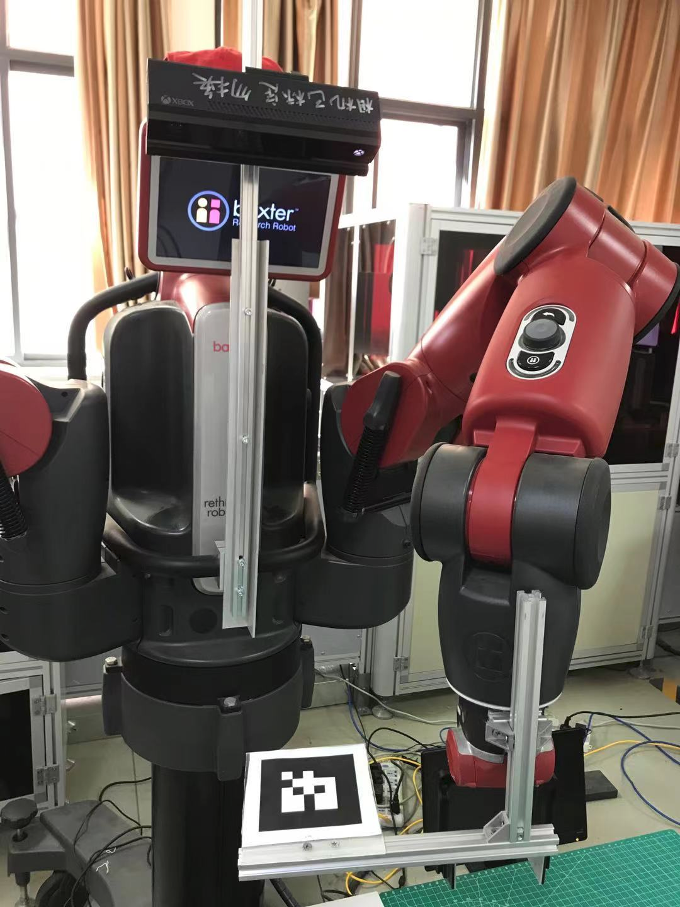
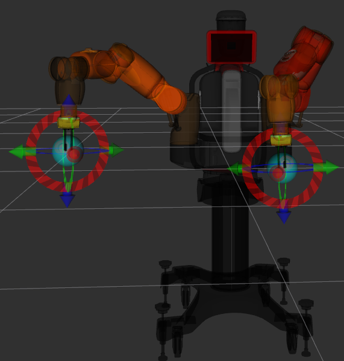
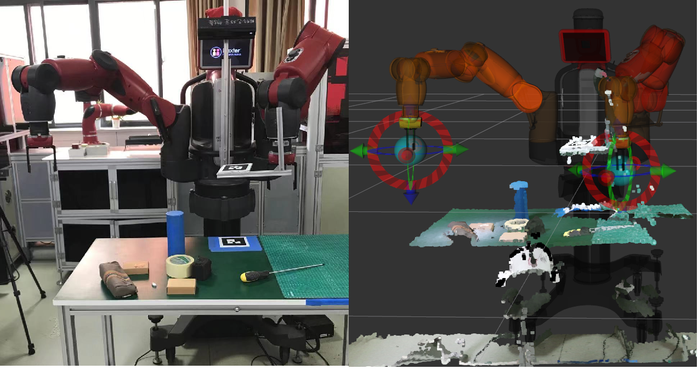
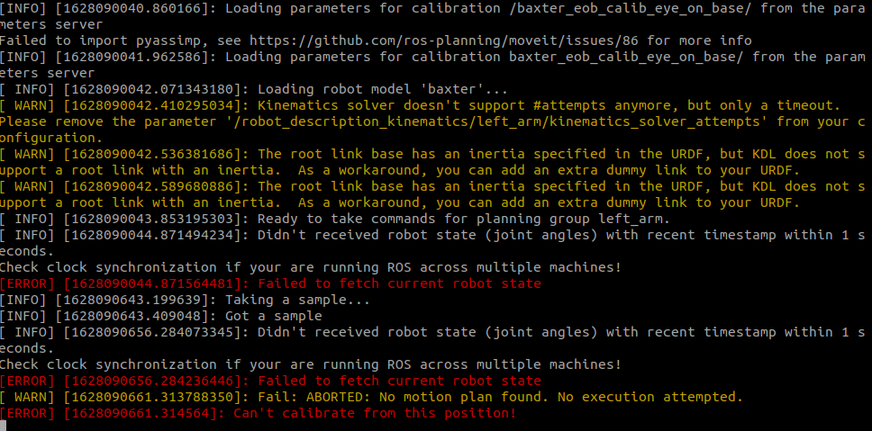

# baxter_hand_eye_calibrate
基于easy_handeye开源项目，对baxter机器人进行手眼标定（Kinect v2）；里面主要是修改了一些easy_handeye中的一些launch文件，实现手眼转换矩阵的计算与发布。

## 依赖

1. 需要安装easy_handeye包;参看https://github.com/IFL-CAMP/easy_handeye；
2. 安装了baxter相关的ROS包；

## 安装

1. 克隆到catkin工作空间中

   ```bash
   cd ~/catkin_ws/src
   git clone https://github.com/Hymwgk/baxter_hand_eye_calibrate.git
   cd ..
   catkin_make
   ```

## 标定

1. 自行安装好相机和标定板，标定板使用 [ar_track_alvar](http://wiki.ros.org/ar_track_alvar/)生成的10cm*10cm的二维码标签，id为7；注意标定板完全处于相机视野范围，并且距离桌面一定距离，防止自动移动时与桌面出现碰撞

   


2. 启动baxter电源，并移动至工作位置

   ```bash
   cd ~/catkin_ws
   . baxter.sh
   rosrun baxter_tools tuck_arms.py -u
   ```

3. 启动关机轨迹控制器，并启动moveit

   ```bash
   cd ~/catkin_ws
   . baxter.sh
   rosrun baxter_interface joint_trajectory_action_server.py
   #另一窗口中
   roslaunch baxter_moveit_config baxter_grippers.launch
   ```

4. 这里利用左臂进行标定，为了加大工作空间，把右臂挪开一点，可以在RVIZ moveit插件中拖动，或者手动挪开

   

   

5. 另一个命令窗口，打开相机

   ```bash
   cd ~/catkin_ws 
   . baxter.sh
   roslaunch kinect2_bridge kinect2_bridge.launch publish_tf:=true
   ```

6. 打开窗口进行监视

   ```bash
   cd ~/catkin_ws 
   . baxter.sh 
   rosrun kinect2_viewer kinect2_viewer kinect2 sd cloud
   ```

   

7. 另一个命令窗口，进行标定，按照提示进行标定

   ```bash
   cd ~/catkin_ws
   source panda_client.sh 
   roslaunch baxter_hand_eye_calibrate  baxter_eob.launch
   ```

## 已标定&使用

1. 发布手眼姿态矩阵

   ```bash
   cd ~/catkin_ws 
   . baxter.sh 
   roslaunch baxter_hand_eye_calibrate publish_baxter_eob.launch
   ```

2. 可以在RVIZ界面添加点云话题，看到具体的标情况

   

## TroubleShooting




   <!--node pkg="robot_state_publisher" type="robot_state_publisher" name="baxter_joint_states_remap" >
      <remap from="/joint_states" to="/robot/joint_states" />
   <!--/node>

